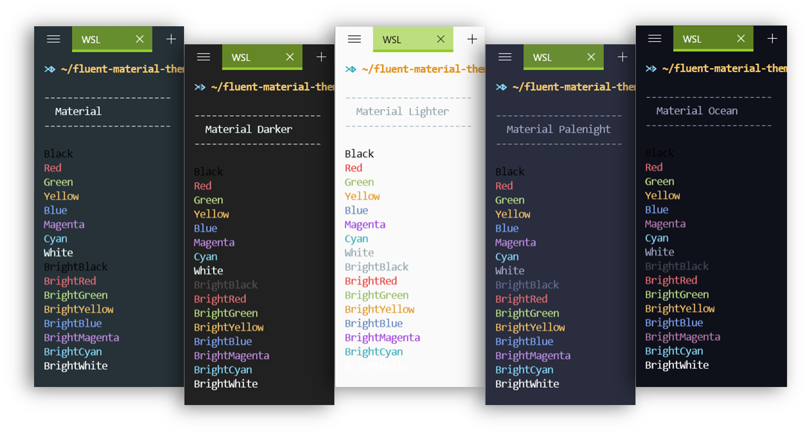

# Material Theme for Fluent Terminal

A port of the [Material Theme](https://github.com/material-theme/vsc-material-theme) for [Fluent Terminal](https://github.com/felixse/FluentTerminal)

This repository publishes the following five themes.

- [Material](./Material.flutecolors)
- [Material Darker](./Material_Darker.flutecolors)
- [Material Lighter](./Material_Lighter.flutecolors)
- [Material Palenight](./Material_Palenight.flutecolors)
- [Material Ocean](./Material_Ocean.flutecolors)

## Usage

1. Download The `.flutecolors` file.
    - [Material](https://raw.githubusercontent.com/idokaraderu/fluent-material-theme/main/Material.flutecolors)
    - [Material Darker](https://raw.githubusercontent.com/idokaraderu/fluent-material-theme/main/Material_Darker.flutecolors)
    - [Material Lighter](https://raw.githubusercontent.com/idokaraderu/fluent-material-theme/main/Material_Lighter.flutecolors)
    - [Material Palenight](https://raw.githubusercontent.com/idokaraderu/fluent-material-theme/main/Material_Palenight.flutecolors)
    - [Material Ocean](https://raw.githubusercontent.com/idokaraderu/fluent-material-theme/main/Material_Ocean.flutecolors)
2. Go to `Settings` > `Themes` and import the file.

## License

[MIT License](LICENSE)